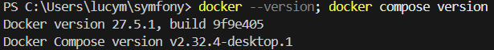
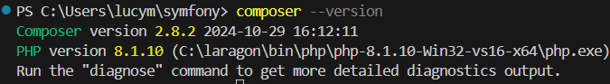

# Configuration de l'Environnement Symfony

Ce document détaille la configuration initiale de l'environnement de développement pour un projet Symfony.

## Prérequis

### 1. Docker et Docker Compose

Docker et Docker Compose sont nécessaires pour créer et gérer notre environnement de développement conteneurisé.

Vérification des versions installées :



### 2. Composer

Composer est le gestionnaire de dépendances PHP utilisé par Symfony.

Vérification de la version installée :



## Structure du Projet

```
jour1/
└── job01/
    ├── images/         # Dossier contenant les captures d'écran
    └── README.md       # Documentation du projet
```

## Étapes Suivantes

Les prochaines étapes consisteront à :
1. Créer un nouveau projet Symfony
2. Configurer Docker pour notre environnement de développement
3. Mettre en place la base de données

---
*Documentation créée le 18 février 2025*
